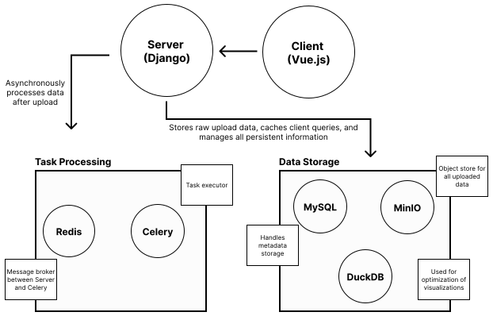

# Loon

## Applications in Loon

### Vue Client

The UI is built using the Vue framework -- a javascript framework for single page web applications and user interfaces.

### Django Server

Django is a Python based web server which has an incredible amount of functionality and flexibility built into it. This is our main messenger between the Client and the rest of the applications.

### MinIO

We use MinIO as a persistent object store to host all of the uploaded experiment data. When uploading a dataset, the Client will first reach out to the Django server for pre-authorization from MinIO. Upon a successful response, the client is then free to upload directly to MinIO

### Celery and Redis

Celery is a Python based background task executor. Shared tasks are defined directly in the Django server. When a task is executed, our message broker (Redis) will inform celery to execute the task. This allows for background and parallel processing of these tasks. Django can then reach out to Redis to determine the status of each celery task.

### MySQL

MySQL is our standard backend database. It is used to to store any information that is necessary for execution of the entire application.

### DuckDB

DuckDB is the database required by our visualization platform Mosaic. It enables quick and efficient interactions for visualizations containing millions of linked data points.

Below is an architecture diagram for the various applications in Loon



Loon is a repository that is meant to be deployed as a standalone docker container. In the repository, there are two docker directories (one is `docker` and the other is `docker-local`). This separates the projects into two distinct pieces: Loon and Local Loon.

## Use And Deployment

All of the necessary applications are shipped in a single docker container. We use a python script called "build.py" to initiate and simplify the process.

**Note that docker and Python 3+ must be installed and running in order to use the "build.py" script**

We start by making a configuration file called "config.json". Below is a template:

```json
{
  "generalSettings": {
    "useHttp": false,
    "environment": "production",
    "baseUrl": "localhost"
  },
  "mySqlSettings": {
    "databaseName": "loon",
    "databaseUser": "user",
    "databasePassword": "user_pass",
    "databaseRootPassword": "root_pass",
    "sourceVolumeLocation": "/Users/bbollen23/loonar-data/mysql-data"
  },
  "minioSettings": {
    "minioStorageAccessKey": "admin",
    "minioStorageSecretKey": "minioadmin",
    "sourceVolumeLocation": "/Users/bbollen23/loonar-data/minio-data"
  },
  "nginxSettings": {
    "sourceVolumeLocation": "/Users/bbollen23/loonar-data/ssl",
    "targetVolumeLocation": "/etc/nginx/ssl",
    "certFileLocation": "certs/localhost.crt",
    "keyFileLocation": "private/localhost.key"
  }
}
```

### General Settings

| Variable      | Details                                                                                          | Possible Values  |
| ------------- | ------------------------------------------------------------------------------------------------ | ---------------- |
| "useHttp"     | Set to true if using HTTP is desired. If set to False, SSL keys will be required                 | true/false       |
| "environment" | Used to determine features disabled during a local version. Most versions will use 'production'. | production/local |
| "baseUrl"     | Base URL for application.                                                                        | string           |

### MySQL Settings

| Variable               | Details                                                                                                              | Possible Values |
| ---------------------- | -------------------------------------------------------------------------------------------------------------------- | --------------- |
| "databaseName"         | Name of database in mysql to create                                                                                  | string          |
| "databaseUser"         | Name of standard user                                                                                                | string          |
| "databasePassword"     | Password for standard user                                                                                           | string          |
| "databaseRootPassword" | Password for root user                                                                                               | string          |
| "sourceVolumeLocation" | Location for the source data to be mounted to the container. This can be any directory with appropriate permissions. | string          |

### MinIO Settings

| Variable                | Details                                                                                                              | Possible Values        |
| ----------------------- | -------------------------------------------------------------------------------------------------------------------- | ---------------------- |
| "minioStorageAccessKey" | Username for MinIO administrator                                                                                     | string (>3 characters) |
| "minioStorageSecretKey" | Password for MinIO administrator                                                                                     | string (>7 characters) |
| "sourceVolumeLocation"  | Location for the source data to be mounted to the container. This can be any directory with appropriate permissions. | string                 |

### NGINX Settings

| Variable               | Details                                               | Possible Values |
| ---------------------- | ----------------------------------------------------- | --------------- |
| "sourceVolumeLocation" | Location for the ssl keys to be mounted to container. | string          |
| "targetVolumeLocation" | Location inside container where to mount keys.        | string          |
| "certFileLocation"     | Name of cert file relative to source volume mount.    | string          |
| "keyFileLocation"      | Name of key file relative to source volume mount      | string          |

The build script will do its best to validate each of these fields before starting the docker container. When running the build script, there are several inputs you can use

| Argument             | Description                                                                                                                                      | Example               |
| -------------------- | ------------------------------------------------------------------------------------------------------------------------------------------------ | --------------------- |
| -h, --help           | Outputs this information to terminal without running script.                                                                                     | -h                    |
| -v, --verbose        | All output response is sent to the terminal and main log file. If not present, limited information will be passed to the terminal.               | -v                    |
| -d, --detached       | Once all containers are started, program will exit and log in the background                                                                     | -d                    |
| -e, --validate-build | When present, the script will not build or start any containers. Only the configuration file will be validated and the environment file created. | -e                    |
| --env-file           | Name of env file to create.                                                                                                                      | .env, .env.production |
| --config-file        | Name of config file to use as input                                                                                                              | config.json           |
| -D, --down           | Stops all containers and removes all containers. Note that this will not build or start containers nor validate the configuration file.          | -D                    |

In the repository, you will see two docker directories: `docker` and `docker-local`. The main deployment will use the `docker` directory. The `docker-local` directory is a separate local version of Loon which we will discuss shortly. Below are some examples.

```bash
python3 build.py
```

The above script will build and then run all containers using a default of "config.json" as the configuration file and creating a ".env" file in the `.build-files` directory.

```bash
python3 build.py --env-file .env.production --config-file config-production.json
```

This will use the "config-production.json" as the input configuration file and output a ".env.production" environment file.

```bash
python3 build.py -vd
```

This will enable verbose mode so that we can see the build process as it runs. It will also exit once all containers have begun running.

If you're using the script not in detached mode, then pressing "Ctrl+C" in the terminal will stop and remove all docker containers. Additionally, all logs will be outputted to a "logs" directory. For each run of the build script, a new directory called `logs_%Y-%m-%d_%H-%M-%S` will be created with logging for each individual service separated.

## For Developers

In order to get started with Loon, we also employ the use of Moon (a monorepo manager) to allow us to more simply install, run, and build the various apps.

### When To Use Moon

Moon is most useful when you're running just the front end component. Because of all the various integrations needed on the backend, running the server will ultimately fail without starting a local copy of Redis, MySQL, and MinIO.

### Installing Moon

We use [Moon](https://moonrepo.dev/) as the monorepo package for managing this repository.

For Linux/Mac you can install Moon with the following:

```bash
curl -fsSL https://moonrepo.dev/install/moon.sh | bash
```

After Moon is installed, you'll need to add Moon to your path. Copy and paste the following in your command line or add it to your profile:

```bash
export PATH="$HOME/.moon/bin:$PATH"
```

The basics usage of moon in our mono repo is to have central commands which run specific functions within each repository. The standard utility is `moon run <project-name>:<task-name>` or `moon <project-name>:<task-name>`. When we have multiple projects with the same task names, we can run each matching task by using `moon :<task-name>`. This allows us to run the server and client simultaneously with one command, allows us to install all necessary packages in all repository in one command, and allows us to have a central place for designing such tasks. You can find the various tasks for each repository in the `apss/<project>/moon.yml` file. Additionally, the `.moon/workspace.yml` file also indicates the project name for each application. For instance, the `apps/client` repository has the project name `client` while the `apps/docs-website` repository has the project name `docs`.

One of the most standard ways you'd like to use Moon is starting the front-end along with the duckdb server. Start with the following:

```bash
moon '#frontend:install'
```

This will install all necessary dependencies for both the duckdb server and the Vue client in their respective directories. Afterwards, run the 'run' command

```bash
moon '#frontend:run'
```

Note that these are based on the "frontend" tag that is present in the `moon.yml` file of both the client and the duckdb repositories.

If you'd like to install all dependencies for all repositories you can run `moon :install`.

### Building and Running the Docs

Similar to the frontend pieces, you can install necessary packages for the documentation website using `moon docs:install` and then run the website using `moon docs:run`.

All tasks can be viewed in the individual repository's moon.yml files.

## EXTRA NOTES

Build docker image on Dockerfile.loon. All commands at root.

```bash
docker build -f ./.build-files/Dockerfile.loon.local -t loon:1.0 .
```

Run:

```bash
docker run --name loon -d \
-e LOCAL_DATA_VOLUME_LOCATION=/Users/bbollen23/loonar-data/local-data \
-v /var/run/docker.sock:/var/run/docker.sock \
-v /Users/bbollen23/loonar-data/local-data/:/app/data \
loon:1.0
```

May have to remove using `docker rm loon`

### Github Deployment

To auto deploy on remote server, make sure following is done:

```bash
cd .build-files
python3 -m venv .venv
source .venv/bin/activate
pip install requirements.txt
python deploy-server.py
```

Runs on port 5421. You must have a ".env.secrets" file which has DEPLOYMENT_AUTH_TOKEN as an environment variable. When sending a post request to server_url/deploy, it will check that you have a header "Authorization" with the token matching DEPLOYMENT_AUTH_TOKEN in .env.secrets. You can specify the path to the .env.secrets file like this:

```bash
python deploy-server.py --env-file /path/to/.env.secrets
```
