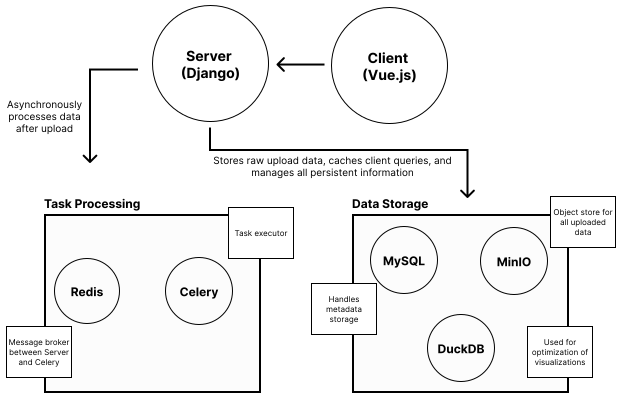

# Loon

## Applications in Loon

### Vue Client

The UI is built using the Vue framework -- a javascript framework for single page web applications and user interfaces.

### Django Server

Django is a Python based web server which has an incredible amount of functionality and flexibility built into it. This is our main messenger between the Client and the rest of the applications.

### MinIO

We use MinIO as a persistent object store to host all of the uploaded experiment data. When uploading a dataset, the Client will first reach out to the Django server for pre-authorization from MinIO. Upon a successful response, the client is then free to upload directly to MinIO

### Celery and Redis

Celery is a Python based background task executor. Shared tasks are defined directly in the Django server. When a task is executed, our message broker (Redis) will inform celery to execute the task. This allows for background and parallel processing of these tasks. Django can then reach out to Redis to determine the status of each celery task.

### MySQL

MySQL is our standard backend database. It is used to to store any information that is necessary for execution of the entire application.

### DuckDB

DuckDB is the database required by our visualization platform Mosaic. It enables quick and efficient interactions for visualizations containing millions of linked data points.

Below is an architecture diagram for the various applications in Loon



Loon is a repository that is meant to be deployed as a standalone docker container. In the repository, there are two docker directories (one is `docker` and the other is `docker-local`). This separates the projects into two distinct pieces: Loon and Local Loon.

## Use And Deployment

All of the necessary applications are shipped in a single docker container. In the repository, you will see two docker directories: `docker` and `docker-local`. The main deployment will use the `docker` directory. The `docker-local` directory is a separate local version of Loon which we will discuss shortly.

### Running the docker container

After installing docker, you'll need to create a ".env" file. Here we have a template ".env" file:

```bash
## Docker container for docker full docker deployment. Only "allowed_host" needs to be changed when deploying on a non-local machine.

# Client settings
VITE_ENVIRONMENT=production
VITE_USE_HTTP=True

# Docker Container Only Settings
DATABASE_ROOT_PASSWORD=root_pass

# General Django Settings
MINIO_ENABLED=True

# Docker Container and Django Settings
SECRET_KEY="django-insecure-z2^vruu347=0e-qyh%&k)%*j9(hgubj$layg&k$-vwb1u+mp93"
DEBUG=True
ALLOWED_HOST='localhost'

# MySQL
DATABASE_NAME=loon
DATABASE_USER=user
DATABASE_PASSWORD=user_pass
DATABASE_HOST=db
DATABASE_PORT=3306

# Celery and Redis
CELERY_BROKER_URL=redis://redis:6379/0
CELERY_RESULT_BACKEND=redis://redis:6379/0

# Minio
MINIO_STORAGE_ENDPOINT=minio:9000
MINIO_STORAGE_ACCESS_KEY=admin
MINIO_STORAGE_SECRET_KEY=minioadmin
MINIO_STORAGE_MEDIA_BUCKET_NAME=data
MINIO_STORAGE_STATIC_BUCKET_NAME=static
MINIO_STORAGE_MEDIA_URL=http://localhost/data
MINIO_STORAGE_STATIC_URL=http://localhost/data
```

Below is a table explaining each of these environment variables. In the "Possible Values" column, values that are bolded are **required**. Values that are italicized are suggestions.

| Variable                         | Details                                                                                                                         | Possible Values                    |
| -------------------------------- | ------------------------------------------------------------------------------------------------------------------------------- | ---------------------------------- |
| VITE_ENVIRONMENT                 | Used to determine features disabled during a local version. Most versions will use 'production'.                                | production/local                   |
| VITE_USE_HTTP                    | Set to true if you are using an HTTP connection rather than an HTTPS connection to deploy the application                       | True/False                         |
| DATABASE_ROOT_PASS               | Password for MySQL root access                                                                                                  | string                             |
| MINIO_ENABLED                    | If False, this will disable all Minio access.                                                                                   | True/False                         |
| SECRET_KEY                       |                                                                                                                                 |                                    |
| DEBUG                            |                                                                                                                                 |                                    |
| ALLOWED_HOST                     | The value of the url which Django should be accessed. Use your custom URL during deployment and 'localhost' for testing locally | string                             |
| DATABASE_NAME                    | Name of database in MySQL                                                                                                       | string                             |
| DATABASE_USER                    | Username for basic MySQL User                                                                                                   | string                             |
| DATABASE_PASSWORD                | Password for basic MySQL User                                                                                                   | string                             |
| DATABASE_HOST                    | Value in docker container corresponding to database.                                                                            | **db**                             |
| DATABASE_PORT                    | Port for MySQL database                                                                                                         | **3306**                           |
| CELERY_BROKER_URL                | Broker URL for Celery tasks                                                                                                     | **redis://redis:6379/0**           |
| CELERY_RESULT_BACKEND            | URL for Server to communicate with when retrieving results                                                                      | **redis://redis:6379/0**           |
| MINIO_STORAGE_ENDPOINT           | Endpoint to communicate with MinIO service                                                                                      | **minio:9000**                     |
| MINIO_STORAGE_ACCESS_KEY         | Username for MinIO administrator                                                                                                | string (>3 characters)             |
| MINO_STORAGE_SECRET_KEY          | Password for MinIO administrator                                                                                                | string (>8 characters)             |
| MINIO_STORAGE_MEDIA_BUCKET_NAME  | Bucket name for MinIO media data                                                                                                | **data**                           |
| MINIO_STORAGE_STATIC_BUCKET_NAME | Bucket name for Minio static data                                                                                               | **static**                         |
| MINIO_STORAGE_MEDIA_URL          | Storage URL for media files                                                                                                     | **{http/https}://{url_name}/data** |
| MINIO_STORAGE_STATIC_URL         | Storage URL for static files                                                                                                    | **{http/https}://{url_name}/data** |

## Local Loon

Local loon is a standalone version of Loon with all of the same features as Loon _except_ uploading data. Instead, this is meant to be deployed alongside the datasets in question. Instead of going through a lengthy process of uploading and processing data, we give users the option of transforming and maintaining their data themselves. Then, instead of using

## For Developers

In order to get started with Loon, we also employ the use of Moon (a monorepo manager) to allow us to more simply install, run, and build the various apps.

### When To Use Moon

Moon is most useful when you're running just the front end component. Because of all the various integrations needed on the backend, running the server will ultimately fail without starting a local copy of Redis, MySQL, and MinIO.

### Installing Moon

We use [Moon](https://moonrepo.dev/) as the monorepo package for managing this repository.

For Linux/Mac you can install Moon with the following:

```bash
curl -fsSL https://moonrepo.dev/install/moon.sh | bash
```

After Moon is installed, you'll need to add Moon to your path. Copy and paste the following in your command line or add it to your profile:

```bash
export PATH="$HOME/.moon/bin:$PATH"
```

The basics usage of moon in our mono repo is to have central commands which run specific functions within each repository. The standard utility is `moon run <project-name>:<task-name>` or `moon <project-name>:<task-name>`. When we have multiple projects with the same task names, we can run each matching task by using `moon :<task-name>`. This allows us to run the server and client simultaneously with one command, allows us to install all necessary packages in all repository in one command, and allows us to have a central place for designing such tasks. You can find the various tasks for each repository in the `apss/<project>/moon.yml` file. Additionally, the `.moon/workspace.yml` file also indicates the project name for each application. For instance, the `apps/client` repository has the project name `client` while the `apps/docs-website` repository has the project name `docs`.

One of the most standard ways you'd like to use Moon is starting the front-end along with the duckdb server. Start with the following:

```bash
moon '#frontend:install'
```

This will install all necessary dependencies for both the duckdb server and the Vue client in their respective directories. Afterwards, run the 'run' command

```bash
moon '#frontend:run'
```

Note that these are based on the "frontend" tag that is present in the `moon.yml` file of both the client and the duckdb repositories.

If you'd like to install all dependencies for all repositories you can run `moon :install`.

### Building and Running the Docs

Similar to the frontend pieces, you can install necessary packages for the documentation website using `moon docs:install` and then run the website using `moon docs:run`.

All tasks can be viewed in the individual repository's moon.yml files.
